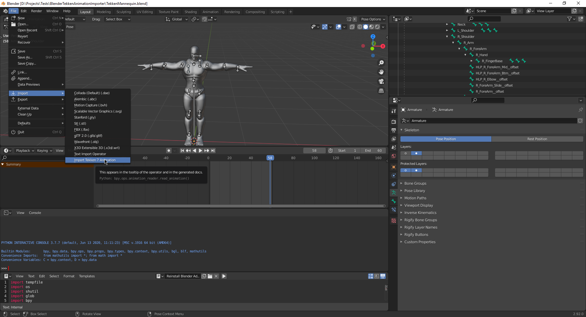

# Tekken 7 animation to Blender importer plugin

This is an attempt to write an importer plugin for Blender to be able import Tekken 7's
 animations into blender.
 
It imprecisely imports Tekken 7's animations of old format(from Tekken 5) into Blender.
 
## Installation instructions
 
- Download the project.
- Open Blender.
- Open `TekkenMannequin.blend` in blender.
- Open Text Editor in Blender. Choose `Reinstall Blender Addon` script from the list
  of scripts.
- Set the name of the folder on the `addon_folder = ` line and path to the folder on
  the `source_path = ` line in the script. So if you have `__init__.py` file in the
  `D:/Projects/Tests/BlenderTekkenAnimationImporter` folder, you set
  `addon_folder = 'BlenderTekkenAnimationImporter'` and `source_path = 'D:/Projects
  /Tests'`, as shown in the script.
- Run the script.
 
You should now have a menu to import Tekken 7 animations of old format into Blender:

After you press on the `Import Tekken 7 Animation` menu, choose `smmn_3A.bin` to import
 Sadamitsu's animation.
 
If everything worked, the plugin should now have imported the animation(imprecisely):
https://www.youtube.com/watch?v=F_ieRBGOi-g

Compare it to the original animation made  by Sadamitsu and in Tekken 7:
- https://www.youtube.com/watch?v=I99V4HTBgxQ
- https://twitter.com/KoenjiUK/status/1298447478686195714?s=20

The problem comes from the fact that Tekken 5's animation format doesn't exactly match
 Tekken 7's armature(skeleton): resting position doesn't match, bones axes don't match
 , and also some bones don't match: some spine bones and inner and outer shoulders
 , and some other. From what I understand, Tekken 5's animations go through additional processing before being applied to Tekken 7's skeleton, which I haven't figured out.
 
If someone extracted Tekken 5 skeleton, it should be possible for the plugin to do what it is intended to do, correctly.

If you're not familiar with Blender plugin development already, I recommend starting here:
[Blender Addon Tutorial](https://docs.blender.org/manual/en/latest/advanced/scripting/addon_tutorial.html).

Go through each article they suggest(if you're not already very knowledgeable in that
 topic). Then read these to understand how and why this project structured the way it
  is structured:
 - [Creating multifile addon for Blender.](https://b3d.interplanety.org/en/creating-multifile-add-on-for-blender/)
 - [Debugging multifile Blender addon by quickly reinstalling it.](https://b3d.interplanety.org/en/debugging-multifile-blender-add-on-by-quick-reinstall/)
 - [Using external IDE PyCharm to write blender scripts.](https://b3d.interplanety.org/en/using-external-ide-pycharm-for-writing-blender-scripts/)
 
After you go through Blender's tutorials and these 3 articles, you should understand how Blender plugin system works, where the plugin execution starts, and be able to start fixing and extending this project.

Because it's a WIP project, it also has additional modules loaded as a proof of concept: addCube and addCubePanel. And in the importMenu it also adds the textReader menu. They're not needed for the plugin to work but they make it very obvious how you would add animation exporter module to the plugin in the future.

### Credits

- Animation is by Sadamitsu.
- Tekken 7 mannequin model exported by Koenji.
- Kilo for providing information about the animation format.